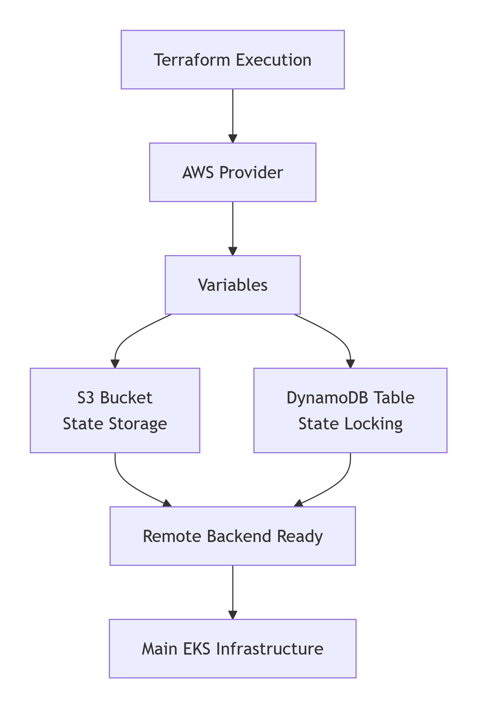

# Phase 1: Terraform Remote State Bootstrap

This directory contains the "Foundation Code." Its sole purpose is to provision the infrastructure required to store the Terraform State safely in the cloud rather than on a local machine.

##  Bootstrap Architecture

<p align="center">
  
</p>

##  Explanations

Terraform needs a place to store its state file (`terraform.tfstate`). If we store it in the same cluster we are building, we can't manage it if the cluster breaks. 

This sub-module solves that by creating two independent AWS resources:
1. **Amazon S3 Bucket**: Acts as the remote storage for the state file.
2. **Amazon DynamoDB**: Acts as a "Locking Mechanism." When one person is running `terraform apply`, DynamoDB locks the state so no one else can make changes simultaneously, preventing state corruption.

---

## File Breakdown

| File | Purpose | Key Feature |
| :--- | :--- | :--- |
| `s3-bucket.tf` | Defines the storage bucket | Uses `var.s3_bucket_name` for global uniqueness |
| `dynamodb.tf` | Defines the locking table | Uses `LockID` as the primary key for Terraform compatibility |
| `variables.tf` | Project configuration | Sets the Region, Project Name, and Environment tags |
| `provider.tf` | AWS Connection | Configures the `aws` provider based on your region variable |

---

## Procedure

### 1. Initialization
Navigate to this directory and initialize the local Terraform backend:
```bash
cd 00_eks-bootstrap
terraform init

```

### 2. Deployment

Provision the S3 bucket and DynamoDB table:

```bash
terraform apply

```

*Review the plan and type `yes` when prompted.*

### 3. Verification

Once complete, verify that the following resources exist in the AWS Console:

* **S3:** `eks-project-terraform-state-0001`
* **DynamoDB:** `eks-project-terraform-locks-0001`

---

## Connection to Main Project

After this phase is complete, the **Main Infrastructure** in the root directory will use these resources via the `01_s3_backend.tf` file:

```hcl
terraform {
  backend "s3" {
    bucket         = "eks-project-terraform-state-0001"
    key            = "state/terraform.tfstate"
    region         = "ap-south-1"
    dynamodb_table = "eks-project-terraform-locks-0001"
  }
}

```

> **Note:** Do not delete these resources unless you have migrated the state back to local storage first, or you will lose track of your EKS infrastructure!
