# Enterprise EKS Platform

This repository contains a full-stack Infrastructure-as-Code (IaC) deployment for an Amazon EKS environment featuring an automated PLG Stack (Prometheus, Loki, Grafana) for observability, RDS MySQL for persistent data, and ElastiCache (Valkey) for caching - all orchestrated via ArgoCD GitOps.

---

## Deployment Guide

### Step 1: Remote State Bootstrap

Before the main infrastructure can be managed, you must create a secure place to store the Terraform State.

1. **Navigate to 00_eks-bootstrap directory:** 
```bash
cd 00_eks-bootstrap/
```

2. **Initialize & Apply:** Run
```bash
terraform init
terraform apply
```

3. This creates the S3 bucket and DynamoDB table used for state locking.

### Step 2: Main Infrastructure Deployment

Once bootstrap is complete, move to the root directory to deploy the full stack.

1. **Configure Variables:** Edit `03_variables.tf` to match your environment settings (e.g., `aws_region`, `project_name`).
2. **Initialize:**
```bash
terraform init

```

3. **Deploy:**
```bash
terraform apply

```

*Note: This process takes approximately 15~20 minutes.*

---

##  CI/CD & Automation Architecture

This project uses an automation model. While the foundation is laid manually, the daily lifecycle is managed via GitHub Actions.

### 1. Manual Foundation (Bootstrap)
The `00_eks-bootstrap` directory is **not** part of the automated pipeline.
* **Logic:** It creates the S3 bucket that the CI/CD pipeline itself depends on. 
* **Action:** You must run this once from your local server or workstation to "unlock" the cloud environment.

### 2. Automated Pipelines (GitHub Actions)
Located in `.github/workflows/`, these handle the "Main" infrastructure automatically.

| Workflow | Trigger | Purpose |
| :--- | :--- | :--- |
| **EKS Infrastructure Pipeline** | `push` to `main` | Automatically applies changes to VPC, EKS, RDS, and Apps. |
| **EKS Infrastructure Destroy** | `Manual Only` | Provides a safe, prompt-protected way to delete the entire stack. |

> **Note on Secrets:** For GitHub Actions to function, you must add `AWS_ACCESS_KEY_ID`, `AWS_SECRET_ACCESS_KEY`, and `SSH_PUBLIC_KEY` to your GitHub Repository Secrets.

---

## Deletion Procedure

We can destroy the infrastructure using either the automated GitHub Actions or the manual CLI method.

### Option 1: Automated Deletion (GitHub Actions)

This is the preferred method for the Main Infrastructure as it ensures a clean, logged teardown.

1. **Main Infrastructure:**
* Navigate to the **Actions** tab in your GitHub repository.
* Select the **"EKS Infrastructure Destroy (MANUAL ONLY)"** workflow.
* Click **Run workflow**, type `DESTROY` in the input field, and confirm.
* *This removes EKS, RDS, VPC, and all associated Kubernetes resources.*


2. **Remote State (Manual):**
* GitHub Actions **cannot** delete the Bootstrap S3 bucket (it needs it to run). Once the Action above is finished, run this locally:

```bash
cd 00_eks-bootstrap
terraform destroy -auto-approve

```

### Option 2: Manual Deletion (CLI)

Use this if you are working directly from your management server. **The order is critical.**

1. **Destroy Main Infrastructure First:**
* From the project root directory:

```bash
terraform init
terraform destroy -auto-approve

```

* *Note: This must be done first because the state file for this infrastructure is stored in the S3 bucket created by the bootstrap.*

2. **Destroy Bootstrap Last:**
* After the main infrastructure is completely gone:

```bash
cd 00_eks-bootstrap
terraform destroy -auto-approve

```

### Important Deletion Notes

* **Sequential Dependency:** Never attempt to destroy the `00_eks-bootstrap` before the Main Infrastructure. If the S3 bucket is deleted first, Terraform will "lose its memory" of the EKS cluster, leaving "zombie" resources running in your AWS account that you will have to delete manually.

---

## Project Phases

To deploy this infrastructure safely, follow the sequence below. Click a Phase name to jump to its detailed explanation.

| Phase | Component | Key Technology | Purpose |
| --- | --- | --- | --- |
| [Phase 1](#phase-1-remote-state-bootstrap) | **Bootstrap** | S3 & DynamoDB | Securely store and lock Terraform state files. |
| [Phase 2](#phase-2-backend-providers--variables) | **Foundation** | Terraform Providers | Configure AWS, Kubernetes, and Helm authentication. |
| [Phase 3](#phase-3-networking) | **Networking** | VPC & Subnets | Establish a 4-tier isolated network (Public/Private/DB/Cache). |
| [Phase 4](#phase-4-eks-cluster--iam-integration) | **Compute** | Amazon EKS 1.33 | Provision the control plane and managed node groups. |
| [Phase 5](#phase-5-secure-access--bastion-management) | **Access** | Bastion Host | Secure SSH entry-point into the private network nodes. |
| [Phase 6](#phase-6-data-layer-rds--elasticache) | **Storage** | RDS & Valkey | Deploy managed database and distributed caching layers. |
| [Phase 7](#phase-7-external-secrets-operator-eso--iam-security) | **Security** | ESO & Secrets Manager | Automate secure credential injection into K8s pods. |
| [Phase 8](#phase-8-full-stack-observability-loki-prometheus--grafana) | **Observability** | PLG Stack | Centralized logging (S3) and metric dashboards ( Prometheus, Loki, & Grafana) |
| [Phase 9](#phase-9-argocd--automated-gitops) | **Continuous Delivery** | ArgoCD | Sync GitHub repositories directly to the cluster. |
| [Phase 10](#phase-10-destruction-anchors--cleanup-sync) | **Cleanup & Teardown Safety** | Terraform Destroy Anchors | Enforce safe deletion order and prevent stuck ALB / EKS resources. |

---

### Phase 1: Remote State Bootstrap
Before the main infrastructure can be managed, we must create a secure place to store the Terraform State. 
* Go to: `00_eks-bootstrap/`
* Purpose: Create an S3 bucket and DynamoDB table for state locking.
* Follow the README inside that directory.

---

###  Phase 2: Backend, Providers & Variables

This section covers the core configuration that allows Terraform to talk to AWS and manage the Kubernetes cluster resources.

<details>
<summary><b>01_s3_backend.tf - Terraform Remote Backend Configuration</b></summary>

This file tells Terraform **where** to save the state of your infrastructure.

* `bucket = "eks-project-terraform-state-0001"`: The S3 bucket where the `.tfstate` file is stored.

* `key = "eks/eks.tfstate"`: The folder path inside the bucket. This keeps the EKS state separate from the bootstrap state.

* `region = "ap-south-1"`: The AWS region (Mumbai) where the bucket resides.

* `dynamodb_table = "eks-project-terraform-locks-0001"`: The table used to "lock" the state. If you are running an update, no one else can change the infra until you're done.

* `encrypt = true`: Ensures the state file is encrypted at rest, protecting sensitive data like database passwords.

Terraform does not use variables in the backend block because Terraform must first know **where the state file is stored** before it can read anything else, including variables; if the state location itself depended on variables, Terraform would not know where to look, which would confuse it and could make it think the infrastructure is new and try to recreate everything, so backend details like bucket and region are kept fixed and simple to avoid breaking state and locking.


</details>

<details>
<summary><b>02_provider.tf - Provider Configuration & Authentication Flow</b></summary>

This file defines **how Terraform authenticates and communicates** with AWS first, and then securely connects to the EKS cluster.

* `required_providers`: Locks the exact provider versions (AWS, Kubernetes, Helm, Kubectl) so future upgrades do not unexpectedly break the infrastructure.

* `provider "aws"`: Configures Terraform to authenticate with AWS and sets the default region where all AWS resources are managed.

* `provider "kubernetes"`, `provider "helm"`, `provider "kubectl"`: These providers do not use static credentials. Instead, they reuse AWS authentication to access the EKS cluster.

* `host`: The EKS API server endpoint, fetched dynamically from the EKS module output.

* `cluster_ca_certificate`: The cluster certificate authority, used to securely verify and trust the EKS API server.

* `exec { ... }`: Executes `aws eks get-token` in the background to generate a short-lived authentication token. This removes the need for a local `kubeconfig` file and ensures access is always secure, temporary, and tied to AWS IAM permissions.

In short, Terraform logs into AWS first, and AWS then grants temporary access to Kubernetes, creating a secure and automated authentication chain without storing Kubernetes credentials.

</details>

<details>
<summary><b>03_variables.tf - Central Project Configuration</b></summary>

This file acts as the **control panel** for the entire Terraform project. Instead of hardcoding values across many files, all important settings are defined here so changes can be made safely from one place.

* **Project Identity**
  * `aws_region` (`ap-south-1`): The AWS region where all infrastructure is created.
  * `project_name` (`eks-infra`): A common prefix added to resource names for easy identification.
  * `project_environment` (`Development`): Used for tagging resources to indicate the environment lifecycle.

* **Network Configuration**
  * `vpc_cidr_block` (`10.0.0.0/16`): The IP address range for the VPC.
  * `route53_hosted_zone_arn`: The Route 53 hosted zone used to create DNS records.

* **EKS Compute Configuration**
  * `eks_node_instance_type` (`t3.medium`): Determines the CPU and memory for EKS worker nodes.
  * `eks_node_ami_type` (`AL2023`): The Amazon Linux image used for the nodes.
  * `eks_node_disk_size` (`20GB`): The root disk size attached to each worker node.

* **Application & GitOps Configuration**
  * `app_repo_url`: The Git repository that stores application and Kubernetes manifests.
  * `app_repo_path`: The directory inside the repository where Kubernetes manifests are located.
  * `app_namespace`: The Kubernetes namespace where the application will be deployed.
  * `app_host`, `grafana_url`, `argocd_url`: Domain names mapped to the Application Load Balancer.

* **Security & Certificates**
  * `my_ip_cidr`: Restricts Bastion host and EKS API access to your local machine only.
  * `certificate_arn`: The ACM certificate used to enable HTTPS traffic.
  * `alb_group_name`: The name of the shared Application Load Balancer group.

Keeping all these values in one file makes the infrastructure easier to understand, safer to modify, and simpler to reuse across different environments like staging and production.

</details>

---

### Phase 3: Networking

This phase defines the **network foundation** for the platform. A **4-tier VPC architecture** is used to isolate public access, application workloads, databases, and cache layers, ensuring security, scalability, and clean traffic separation.

<details>
<summary><b>04_vpc.tf - VPC & Subnet Architecture</b></summary>

This file uses the official AWS VPC module to create the core network layout for the EKS platform.

* **Core Network**
  * `name`: Sets the VPC name using the project identifier.
  * `cidr`: Defines the main IP range (`10.0.0.0/16`) for all subnets.
  * `azs`: Spreads resources across three Availability Zones (`1a`, `1b`, `1c`) for high availability.

* **Subnet Strategy**
  * `public_subnets`: Hosts the Application Load Balancer and NAT Gateway.
  * `private_subnets`: Used by EKS worker nodes, with no direct internet access.
  * `database_subnets`: Isolated subnets dedicated to the RDS MySQL database.
  * `elasticache_subnets`: Isolated subnets dedicated to Valkey/Redis.

* **Internet Access (NAT)**
  * `enable_nat_gateway`: Allows private resources to access the internet for updates.
  * `single_nat_gateway`: Uses one NAT Gateway across all AZs to reduce cost.

* **Kubernetes Integration Tags**
  * `kubernetes.io/role/elb`: Marks public subnets for internet-facing load balancers.
  * `kubernetes.io/role/internal-elb`: Marks private subnets for internal load balancers.
  * `kubernetes.io/cluster/...`: Allows EKS to discover and manage networking resources inside the VPC.

This structure ensures that only the load balancer is exposed publicly, while application workloads, databases, and caches remain protected.

</details>

<details>
<summary><b>05_vpc_outputs.tf - VPC Output Values</b></summary>

This file exposes key VPC details so other parts of the infrastructure can safely reference them.

* `vpc_id`: Used when creating security groups and networking rules.
* `public_subnet_ids`: Consumed by the Bastion host and public load balancers.
* `private_subnet_ids`: Used for provisioning EKS worker nodes.

Outputs allow networking details to be reused without hardcoding values, keeping the configuration modular and clean.

</details>

---

### Phase 4: EKS Cluster & IAM Integration

This phase builds the **Kubernetes control plane**, worker nodes, and the **IAM bridge** that allows Kubernetes pods to securely access AWS services without hardcoded credentials.

<details>
<summary><b>06_key_pair.tf - SSH Access Configuration</b></summary>

This file manages SSH access for troubleshooting and maintenance on the Bastion host and EKS worker nodes.

Before running Terraform, you must have a public key available.

* **Generate a key locally:**

If you don't have a key, run the following command in your terminal:
```bash
ssh-keygen -t rsa -b 4096 -f ./files/eks-key

```
After generation, SSH requires strict permissions on the private key file. If the permissions are too open, SSH will reject the key for security reasons:
```bash
chmod 400 ./files/eks-key

```

While this project uses the name `eks-key.pub` by default, you can name your file anything. If you change the name, ensure you update the `public_key` path in `06_key_pair.tf` and the reference in `11_bastion_host_setup.tf`.

* **Local Execution:** Place your `.pub` file directly into the `./files` directory. Terraform will read it using the `file()` function during the plan phase.
* **GitHub Actions (CI/CD):** You do **not** need to commit your key to Git. Instead:
  1. Copy the contents of your `.pub` file.
  2. Add it as a GitHub Secret named `SSH_PUBLIC_KEY`.
  3. The workflow is pre-configured to automatically recreate the file at `./files/eks-key.pub` on the GitHub runner before running Terraform.
  4. Keep your private key (`eks-key`) on your local server or management machine to log in later.

* **SSH Key Setup**
  * `key_name`: The logical name used by AWS to reference the SSH key.
  * `public_key`: Reads the public key from `./files/eks-key.pub` using the `file()` function.
  * `tags`: Applies project and environment tags for tracking and governance.

This ensures controlled, auditable SSH access without embedding private keys in Terraform.

</details>

<details>
<summary><b>07_eks.tf - EKS Cluster, Node Groups & IRSA</b></summary>

This is the **core file** of the platform. It provisions the EKS cluster, worker nodes, networking add-ons, and IAM Roles for Service Accounts (IRSA).

* **EKS Control Plane**
  * `source`: Uses the industry-standard Terraform AWS EKS module.
  * `kubernetes_version`: Specifies the Kubernetes version used by the cluster.
  * `enable_irsa`: Creates an OIDC provider so Kubernetes service accounts can assume AWS IAM roles.
  * `enable_cluster_creator_admin_permissions`: Grants admin access to the user who creates the cluster.

* **Core Networking Add-ons**
  * `eks-pod-identity-agent`: The modern way to handle IAM permissions for pods.
  * `coredns`: Handles service discovery inside the cluster.
  * `kube-proxy`: Manages network routing rules on worker nodes.
  * `vpc-cni`: The AWS networking plugin that assigns VPC IPs to pods.
  * `ENABLE_PREFIX_DELEGATION`: Set to "true". This allows each node to handle more IP addresses, preventing "IP exhaustion" in small subnets.
  * `WARM_PREFIX_TARGET`: Keeps 1 IP prefix ready to speed up pod startup times.

* **Cluster Placement**
  * `vpc_id`: Deploys the cluster inside the VPC created earlier.
  * `subnet_ids`: Places worker nodes in private subnets.
  * `control_plane_subnet_ids`: Keeps the Kubernetes API endpoint private and secure.

* **Managed Node Groups**
  * `ami_type`: Uses Amazon Linux 2023, optimized for EKS.
  * `instance_types`: Defines CPU and memory capacity.
  * `key_name`: Attaches the SSH key from `06_key_pair.tf`.
  * `http_tokens = "required"`: Enforces IMDSv2 to protect IAM credentials.
  * `scaling_config`: Sets minimum and maximum node counts to balance cost and availability.

* **IAM Roles for Service Accounts (IRSA)**
  * `ebs_csi_driver_irsa`: Allows pods to create and attach EBS volumes. Creates the IAM role with `attach_ebs_csi_policy = true`.
  * `lb_controller_irsa`: Allows Kubernetes to create and manage ALBs. Creates a role with `attach_load_balancer_controller_policy = true`.
  * `external_dns_irsa`: Creates a role to allow the cluster to update Route53 DNS records automatically.
  * `oidc_providers`: Links these IAM roles to the EKS cluster OIDC URL so only your cluster can use them. OIDC binding ensures only this cluster can assume these roles.

* **Blueprint Add-ons**
  * `aws-ebs-csi-driver`: Installs the driver that actually creates EBS volumes for your databases.
  * `enable_aws_load_balancer_controller`: Installs the controller that creates the AWS Application Load Balancer.
  * `enable_metrics_server`: Installs the service that allows `kubectl top nodes` and horizontal scaling.
  * `enable_external_dns`: Installs the service that syncs your K8s Ingress hostnames to Route53.

* **Security & Connectivity**
  * `kubernetes_storage_class_v1`: Defines `gp3` (SSD) as the default storage. `WaitForFirstConsumer` ensures the disk is created in the same AZ where the pod is running.
  * `bastion_to_api`: An Ingress rule allowing the Bastion Security Group to talk to the Cluster API (Port 443).
  * `bastion_to_node_ssh`: An Ingress rule allowing the Bastion to SSH into worker nodes (Port 22).

This phase completes the secure foundation that connects AWS, Kubernetes, and IAM into a single, production-ready platform.

</details>

<details>
<summary><b>08_eks_outputs.tf - Outputs for EKS cluster </b></summary>

This file exposes key EKS details so other parts of the infrastructure can reference them.

* **Cluster Name:** `eks_cluster_name` - Used for `aws eks update-kubeconfig`.
* **API Endpoint:** `eks_cluster_endpoint` - The HTTPS URL for the Kubernetes API server.
* **K8s Version:** `eks_cluster_version` - The version of Kubernetes currently running (e.g., 1.30).
* **Security Group:** `eks_cluster_security_group_id` - The primary SG managing traffic to the cluster nodes.

</details>

---

### Phase 5: Secure Access & Bastion Management

This phase sets up a **secure entry point** into the private infrastructure. The Bastion host acts as a controlled gateway for administrators to access AWS and the EKS cluster without exposing internal resources to the internet.

<details>
<summary><b>09_bastion_host_security_group.tf - Bastion Firewall Rules</b></summary>

This file defines strict network rules to protect the Bastion host.

* **Ingress (Incoming Traffic)**
  * Allows SSH access on port `22`.
  * Access is restricted to `var.my_ip_cidr`, ensuring only your personal public IP can connect.

* **Egress (Outgoing Traffic)**
  * Allows all outbound traffic so the Bastion can communicate with AWS APIs and download required tools.

</details>

<details>
<summary><b>10_iam_bastion.tf - Bastion IAM Role & Permissions</b></summary>

This file creates the **AWS identity** for the Bastion host, allowing it to interact securely with EKS and other AWS services.

* **IAM Policy**
  * `eks:DescribeCluster`: Allows the Bastion to retrieve EKS cluster details.
  * `sts:GetCallerIdentity`: Required for AWS CLI authentication checks.

* **IAM Role & Instance Profile**
  * `aws_iam_role`: The actual identity the EC2 instance "assumes."
  * `aws_iam_instance_profile`: The container that attaches the IAM Role to the EC2 hardware.

This removes the need for static AWS credentials on the server.

</details>

<details>
<summary><b>11_bastion_host_setup.tf - Bastion EC2 Provisioning</b></summary>

This file provisions the Bastion EC2 instance and prepares it for cluster management.

* **AMI Selection**
  * `data "aws_ami"`: Dynamically finds the latest Amazon Linux 2023 image.

* **Instance Configuration**
  * `instance_type = "t2.micro"`: Keeps costs low (Free Tier eligible).
  * `subnet_id`: Places the Bastion in the **Public Subnet** so it is reachable via the internet.
  * `associate_public_ip_address`: Assigns a public IP so you can SSH into it.
  * `user_data`: Runs the `./files/bastion_setup.sh` script on startup to automatically install `kubectl`, `helm`, and `aws-cli`.

* **Storage**
  * `volume_size = 5`: A small 5GB disk for logs and tools.
  * `encrypted = true`: Ensures any sensitive scripts on the disk are protected.

The Bastion is fully configured on first boot, with no manual setup required.

</details>

<details>
<summary><b>12_eks_bastion_access.tf - EKS Access Integration</b></summary>

This file grants the Bastion host **explicit access** to the Kubernetes cluster.

* Registers the Bastion IAM role as a valid EKS principal.
* Uses EKS Access Entries instead of the legacy `aws-auth` ConfigMap.
* Grants full cluster administrator permissions.

* **EKS Access Entry**
  * `principal_arn`: Registers the Bastion's IAM Role as a recognized user in the EKS cluster.
  * `type = "STANDARD"`: The modern EKS way to manage access without editing the `aws-auth` ConfigMap.

* **Policy Association**
  * `policy_arn = "...AmazonEKSClusterAdminPolicy"`: Grants the Bastion full **Administrator** rights inside Kubernetes.
  * `access_scope`: Set to `cluster`, meaning the Bastion can manage all namespaces and resources.

This ensures Bastion access is managed through AWS APIs.

</details>

<details>
<summary><b>files/bastion_setup.sh - Bastion Bootstrap Script</b></summary>

This user data script runs automatically when the Bastion instance starts.

* **System Prep**: Updates the OS and installs utility tools like `jq` (for parsing JSON) and `unzip`.
* **AWS CLI**: Installs the latest Version 2 of the AWS command-line tool.
* **kubectl**: The primary tool for running commands against Kubernetes clusters. It dynamically fetches the latest stable version.
* **Helm**: Installs the "Package Manager for Kubernetes," which is used in later phases to deploy ArgoCD and the Monitoring stack.
* **Verification**: The script ends by printing the versions to the system log, so you can verify the setup was successful.


The result is a ready-to-use administrative environment without manual intervention.

</details>

<details>
<summary><b>13_bastion_outputs.tf - Outputs for bastion host</b></summary>

* **Public IP:** `bastion_public_ip` - Use this to SSH into the environment.
* **Public DNS:** `bastion_public_dns` - The AWS-assigned hostname for the bastion.
* **Instance ID:** `bastion_instance_id` - Useful for AWS CLI commands or checking status in the console.

</details>

---

###  Phase 6: Data Layer (RDS & ElastiCache)

This phase provisions the **persistent data services** used by the platform. Both the database and cache layers are fully isolated from the internet and can only be accessed by authorized internal components.

<details>
<summary><b>14_rds_eca_securitygroup.tf - Data Layer Security Groups</b></summary>

This file defines the networking "gatekeepers" for your data. It ensures that only authorized traffic can reach your databases.

* **RDS Security Group (`rds_sg`)**
  * `name`: Identifies the group as the MySQL firewall.
  * `vpc_id`: Anchors the firewall to the project VPC.
  * `rds_from_eks`: A specific ingress rule allowing traffic on **Port 3306** (MySQL) only from the EKS Worker Nodes.
  * `rds_from_bastion`: A specific ingress rule allowing traffic on **Port 3306** from the Bastion host, enabling you to run database migrations or manual queries.

* **ElastiCache Security Group (`redis_sg`)**
  * `name`: Identifies the group as the Redis/Valkey firewall.
  * `redis_from_eks`: A specific ingress rule allowing traffic on **Port 6379** (Redis default) only from the EKS Worker Nodes.
  * `redis_from_bastion`: Allows you to test cache connectivity from the Bastion host on **Port 6379**.

</details>

<details>
<summary><b>15_rds.tf - Managed MySQL Database (RDS)</b></summary>

This file provisions the managed MySQL database.

* **Engine Configuration**
  * `engine = "mysql"`: Uses the community MySQL engine.
  * `engine_version = "8.0"`: Standardizes on version 8.0 for modern feature support.
  * `instance_class = "db.t4g.micro"`: Uses AWS Graviton2 processors for the best price-to-performance ratio in the free/low-cost tier.

* **Storage & Settings**
  * `allocated_storage = 20`: Sets the initial disk size to 20GB.
  * `db_name = "company"`: Automatically creates the initial database schema name.
  * `username = "appadmin"`: Sets the master username.
  * `manage_master_user_password`: Tells AWS to generate a secure password and manage it (can be retrieved via Secrets Manager).

* **Networking & Safety**
  * `db_subnet_group_name`: Places the DB into the dedicated isolated database subnets created in Phase 2.
  * `publicly_accessible = false`: **Security Requirement.** Ensures the database has no public IP and cannot be reached from the internet.
  * `skip_final_snapshot = true`: Disables the final backup during `terraform destroy` to speed up the teardown process (use only for Dev).
  * `deletion_protection = false`: Allows Terraform to delete the DB during cleanup without manual intervention.

</details>

<details>
<summary><b>16_rds_outputs.tf - Outputs for Managed MySQL Database (RDS)</b></summary>

* **RDS Endpoint:** `rds_endpoint` - The hostname your application uses to connect to MySQL.
* **RDS Port:** `rds_port` - Defaults to `3306`.
* **Identifier:** `rds_identifier` - The unique name of the RDS instance in the AWS console.

</details>

<details>
<summary><b>17_eca.tf - ElastiCache Valkey Cluster</b></summary>

This file provisions the Valkey (Redis-compatible) caching layer.

* **Cache Engine**
  * `engine = "valkey"`: Uses the high-performance, open-source Valkey engine (Redis alternative).
  * `engine_version = "8.2"`: Sets the specific engine version.
  * `node_type = "cache.t4g.micro"`: Cost-effective Graviton instance for caching.

* **Cluster & Scalability**
  * `cluster_mode_enabled`: Enables the cluster architecture for better performance.
  * `num_node_groups = 1`: Creates a single shard for the data.
  * `replicas_per_node_group = 0`: Disables replicas to save costs during development (single-node setup).

* **Network & Security**
  * `subnet_group_name`: Places the cache nodes in the private ElastiCache subnets.
  * `create_security_group = false`: We use the manual security group created in File 12 to have better control over ingress rules.
  * `apply_immediately`: Ensures that configuration changes are applied instantly rather than waiting for a maintenance window.

</details>

<details>
<summary><b>18_eca_outputs.tf - Outputs for ElastiCache Valkey Cluster</b></summary>

* **Configuration Endpoint:** `valkey_configuration_endpoint` - The cluster-level endpoint for your Valkey (Redis-compatible) cache.
* **Valkey Port:** `valkey_port` - Typically `6379`.

</details>

---

### Phase 7: External Secrets Operator (ESO) & IAM Security

This phase solves a critical security problem: **getting database credentials into Kubernetes without humans ever seeing or handling passwords**. AWS generates the secrets, and Kubernetes consumes them automatically using IAM-based trust.

<details>
<summary><b>19_eso_iam.tf - IAM Role for External Secrets Operator</b></summary>

* **module "external_secrets_irsa"**:
  * `source`: Uses the official IAM module for EKS Service Accounts.
  * `role_name`: Assigns a clear name to the IAM role in the AWS Console.
  * `depends_on`: Ensures the EKS cluster exists before trying to create an OIDC link to it.
  * `oidc_providers`: This is the trust relationship. It tells AWS "I trust the OIDC identity issued by this specific EKS cluster."
  * `namespace_service_accounts`: This is a security lock. It ensures **only** the Service Account named `external-secrets-sa` in the `external-secrets` namespace can use this IAM role.
  * `role_policy_arns`: Attaches the custom permission policy we define below.

* **resource "aws_iam_policy" "external_secrets_policy"**:
  * `name`: The display name of the permission set in AWS.
  * `Action`: Specifies exactly what the operator can do: `GetSecretValue` (read the password) and `DescribeSecret` (get metadata).
  * `Effect = "Allow"`: Grants these permissions.
  * `Resource`: This is the most important security line. It restricts the operator to ONLY read the secret belonging to your RDS instance (`module.db.db_instance_master_user_secret_arn`). It cannot read any other secrets in your account.

</details>

<details>
<summary><b>20_eso_helm.tf - External Secrets Operator Installation</b></summary>

This file installs the External Secrets Operator into the cluster and configures how it connects to AWS.

* **resource "helm_release" "external_secrets"**:
  * `repository`: The official source URL for the External Secrets Helm charts.
  * `chart`: The name of the package to install.
  * `version`: Pins the software version to `0.16.1` to prevent unexpected updates.
  * `create_namespace`: Tells Helm to create the `external-secrets` namespace if it doesn't exist.
  * `depends_on`: Ensures the EKS nodes and Blueprints (like the Load Balancer Controller) are ready before installing this.
  * `set { installCRDs = "true" }`: Installs the "Custom Resource Definitions." This teaches Kubernetes new commands like `ClusterSecretStore`.
  * `set { serviceAccount.annotations... }`: This is the link. It adds the IAM Role ARN to the Kubernetes Service Account so the pod can authenticate with AWS.

* **resource "kubectl_manifest" "cluster_secret_store"**:
  * `depends_on`: This must wait for the Helm chart to finish installing the CRDs, otherwise the command will fail.
  * `yaml_body`: This is the actual configuration that tells the operator how to behave.
  * `kind: ClusterSecretStore`: Creates a global secret provider that can be used by any namespace in the cluster.
  * `spec.provider.aws`: Tells the operator to talk to **AWS Secrets Manager**.
  * `region`: Uses your variable to look for secrets in the `ap-south-1` region.
  * `auth.jwt.serviceAccountRef`: Tells the operator: "When you try to log into AWS, use the permissions attached to the `external-secrets-sa`."

Once installed, Kubernetes understands **how and where** to fetch secrets securely.

</details>

#### Secret Flow (End-to-End)

1. AWS RDS generates the master database password and stores it in AWS Secrets Manager.
2. Terraform installs the External Secrets Operator into the EKS cluster.
3. The ESO pod assumes its IAM role using IRSA.
4. The ClusterSecretStore points ESO to the correct AWS region.
5. ESO reads the secret and creates a native Kubernetes Secret.
6. Application pods consume the secret like any normal Kubernetes credential.

---

###  Phase 8: Full-Stack Observability (Loki, Prometheus & Grafana)

This phase builds a professional-grade monitoring and logging pipeline. Instead of storing logs on expensive and volatile EBS disks, we offload everything to **AWS S3** for long-term durability and cost-efficiency. This ensures that even if your nodes are deleted, your logs remain safe and searchable.


<details>
<summary><b>21_monitoring_s3.tf - S3 Storage & IAM for Loki</b></summary>

This file creates the "Hard Drive" in the cloud where Loki will store its data.

* **aws_s3_bucket "loki_logs"**:
  * `bucket`: Dynamically names the bucket using your project prefix (e.g., `eks-infra-loki-logs`).
  * `force_destroy = true`: Allows the bucket to be deleted during `terraform destroy` even if it contains log files.

* **module "loki_irsa"**:
  * `source`: Creates an IAM Role for Service Accounts (IRSA).
  * `role_name`: The name of the role as it appears in the AWS Console.
  * `namespace_service_accounts`: It says "Only the pod using the service account `monitoring-stack-loki` in the `monitoring` namespace can use this role."

* **resource "aws_iam_policy" "loki_s3_policy"**:
  * `s3:ListBucket`: Allows Loki to see the "folders" and files inside the bucket.
  * `s3:GetObject`: Allows Loki to read logs when you search for them in Grafana.
  * `s3:PutObject`: Allows Loki to write new logs coming in from the cluster.
  * `s3:DeleteObject`: Allows Loki to clean up old logs based on your retention policy.

</details>

<details>
<summary><b>22_monitoring_helm.tf - Monitoring Stack Deployment</b></summary>

This file handles the deployment and complex logic of the monitoring software.

* **resource "kubernetes_namespace_v1" "monitoring"**:
  * Creates an isolated logical boundary in Kubernetes specifically for monitoring tools.

* **resource "helm_release" "monitoring_stack"**:
  * `recreate_pods = true`: Forces pods to restart if you change the configuration, ensuring no old settings linger.
  * `templatefile(...)`: This is where the magic happens. It takes the `values-s3.yaml.tpl` file and injects your real AWS bucket names and IAM Role ARNs into the configuration.
  * `grafana.ini`: Configures the Grafana web server.
  * `domain / root_url`: Sets the URL (`grafana.sreevasmk.in`) and ensures that when you click a link in Grafana, it uses the secure HTTPS domain.
  * `serve_from_sub_path`: Required for the Application Load Balancer to route traffic to Grafana correctly.

</details>

<details>
<summary><b>23_grafana_ingress.tf - Public Access via ALB</b></summary>

This file makes Grafana accessible via the internet through an AWS Application Load Balancer.

* **metadata.annotations**:
  * `ingress.class = "alb"`: Triggers the AWS LB Controller to provision a physical Load Balancer.
  * `group.name`: This is a cost-saver. It merges this Ingress with your App and ArgoCD into one single ALB.
  * `certificate-arn`: Attaches your SSL certificate for HTTPS encryption.
  * `ssl-redirect`: Automatically redirects any user on port 80 (HTTP) to 443 (HTTPS).
  * `healthcheck-path = "/api/health"`: Tells the ALB how to check if Grafana is actually running.

</details>

<details>
<summary><b>.files/values-s3.yaml.tpl - Monitoring Stack Configuration</b></summary>

This is the most important configuration file. Here is exactly what the code does:

* **Loki (The Log Database)**:
  * `image.tag: 2.9.0`: Pins the version of Loki to ensure stability.
  * `serviceAccount.annotations`: This injects the `${loki_iam_role_arn}`. Without this line, Loki cannot talk to S3 and will crash.
  * `persistence.enabled: false`: We disable "Persistent Volumes" because we don't want to use expensive AWS EBS disks; we use S3 instead.
  * `config.common.storage.s3`: Tells Loki the exact bucket name and AWS region to store logs.
  * `schema_config`: Configures how logs are indexed.
  * `store: boltdb-shipper`: The modern way to handle indexes.
  * `object_store: s3`: Tells Loki that the actual log "blobs" should live in S3.
  * `schema: v13`: The latest data structure for Loki logs.
  * `retention_period: 24h`: Every 24 hours, Loki will delete old logs from S3 to keep your AWS bill low.

* **Promtail (The Log Collector)**:
  * `enabled: true`: Promtail runs as a "DaemonSet" (one pod on every node).
  * `clients.url`: Tells Promtail to send all the logs it finds to the Loki service at port 3100.
  * `scrape_configs`:
  * `role: pod`: Promtail looks at every single Pod running on the node.
  * `relabel_configs`: It takes the Pod's name and Namespace and turns them into "labels" in Grafana so you can filter logs by "App" or "Namespace."

* **Prometheus (The Metrics Engine)**:
  * `enabled: true`: Starts the metrics collection.
  * `extraScrapeConfigs`: This is a huge section that tells Prometheus to "auto-discover" everything in the cluster.
  * `job_name: kubernetes-pods-all`: Finds every pod and asks for its CPU/RAM usage.
  * `job_name: kubernetes-nodes-all`: Checks the health of the physical EC2 instances.

* **Node Exporter**:
  * `tolerations`: These lines allow the monitoring agent to run on "special" nodes that might have taints (like the control plane), ensuring 100% coverage of your cluster.

</details>

<details>
<summary><b>.files/monitoring-configmap.yml - Grafana Data Sources</b></summary>

This file configures Grafana so it knows where to find data.

* **metadata.labels**:
  * `grafana_datasource: "1"`:  Grafana has a "sidecar" container that searches the cluster for any ConfigMap with this label and automatically adds it as a source.

* **data.datasources.yaml**:
  * `name: Prometheus`: The name that appears in the Grafana dropdown.
  * `url: http://monitoring-stack-prometheus-server:9090`: The internal network address of Prometheus.
  * `name: Loki`: The name for the log source.
  * `url: http://monitoring-stack-loki:3100`: The internal network address of Loki.

</details>

---

###  Phase 9: ArgoCD & Automated GitOps

This phase sets up **ArgoCD**, the tool that automates your deployments from Git into Kubernetes. Instead of manually applying YAMLs or Helm charts every time you update your app, ArgoCD constantly monitors your Git repository and makes sure the cluster matches exactly what's declared in Git.  

<details>
<summary><b>24_argocd.tf - ArgoCD installation</b></summary>

This file installs the ArgoCD engine itself.

* **kubernetes_namespace "argocd"**:
  * Creates a dedicated, isolated home for the ArgoCD system.
  * `depends_on`: Ensures the EKS cluster and nodes are fully active before trying to install software.


* **helm_release "argocd"**:
  * `repository`: Pulls from the official `argo-helm` charts.
  * `set { configs.cm.url }`: Tells ArgoCD its own public address (`argocd.sreevasmk.in`) so it can generate correct internal links.
  * `set { configs.params.server.insecure = "true" }`: This allows the AWS Load Balancer to talk to ArgoCD over plain HTTP/HTTPS without complicated internal certificate handshakes, as the ALB handles the external SSL.


</details>

<details>
<summary><b>25_argocd_application.tf - ArgoCD application deployment</b></summary>

It connects the infrastructure you built (RDS, Valkey) to your application code.

* **kubernetes_namespace_v1 "app_ns"**:
  * Creates the namespace where your actual Flask app will run.

* **Pod Security Labels**: These are modern K8s security standards.
  * `enforce: baseline`: Prevents pods from running with dangerous "root" privileges.
  * `warn: restricted`: Warns the developer if they are not following the strictest security best practices.

* **kubectl_manifest "employees_app"**:
  * This is an **ArgoCD Application Custom Resource**. It defines the "What, Where, and How."
  * `source`: Points to your GitHub repo (`repoURL`) and the specific folder where your Helm charts live (`path`).

* **Helm Parameters (Injecting Infrastructure into Apps)**:
  * `flask.env.DB_HOST`: Injects the real RDS endpoint address created in Phase 5.
  * `flask.env.REDIS_HOST`: Injects the Valkey endpoint. The `split` function is used to remove the port number from the URL string.
  * `flask.secrets.remoteRef.key`: Passes the **AWS Secrets Manager ARN**. The External Secrets Operator (Phase 6) will use this to grab the DB password.

<p align="center">
  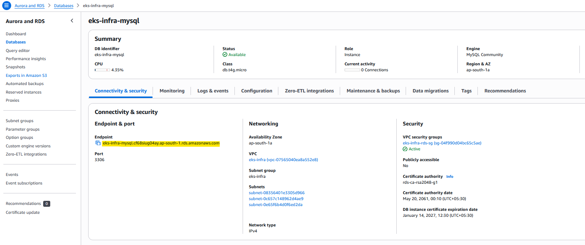
</p>

<p align="center">
  
</p>

<p align="center">
  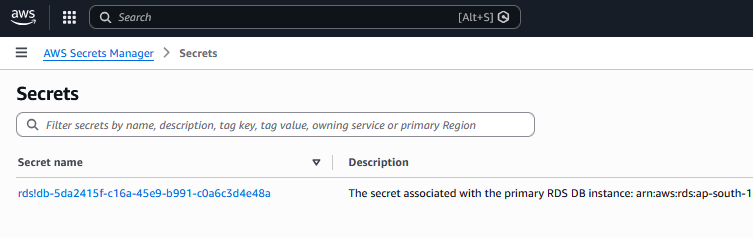
</p>


* **`syncPolicy`**:
  * `automated.prune`: If you delete a resource from Git, ArgoCD will automatically delete it from K8s.
  * `automated.selfHeal`: If someone manually changes something in K8s, ArgoCD will overwrite it back to the Git state.


</details>

<details>
<summary><b>26_argocd_ingress.tf - Exposing ArgoCD UI via AWS ALB</b></summary>

This file exposes the ArgoCD UI to you so you can monitor your deployments in a browser.

* **metadata.annotations**:
  * `ingress.class = "alb"`: Triggers the AWS ALB creation.
  * `group.name`: **CRITICAL.** This joins ArgoCD, Grafana, and your Flask app under **one single Load Balancer**. This saves you roughly **$40/month** in AWS costs by sharing one ALB across three services.
  * `backend-protocol = "HTTPS"`: Since ArgoCD is highly secure, it expects internal traffic to be encrypted.
  * `healthcheck-path = "/healthz"`: The specific URL the ALB pings to make sure ArgoCD is healthy.

* **spec.rule**:
  * `host`: Listens for `argocd.sreevasmk.in`.
  * `backend.service.port.number = 443`: Forwards the traffic to ArgoCD's secure internal port.

</details>

---

### Phase 10: Destruction Anchors & Cleanup Sync

This phase manages the "Invisible Dependencies." In EKS, certain resources (like Ingresses) create AWS Application Load Balancers (ALBs) that Terraform doesn't directly track. This phase ensures these external resources are cleaned up before the network is destroyed.

<details>
<summary><b>27_cleanup_sync.tf - The Destruction Buffer</b></summary>

This file handles the timing of the "Teardown" process.

* **resource "null_resource" "destruction_dependencies"**
* **The Trigger**: This resource acts as a gatekeeper. It "depends on" every single high-level Kubernetes resource (Helm charts, Ingresses, Namespaces, and ArgoCD apps).
* **Creation**: During `apply`, it does nothing.
* **Destruction**: During `destroy`, it is the **first** thing to trigger because everything else depends on it.
* **local-exec (sleep 60)**: It runs a 60-second sleep command. This provides a "buffer window" for the AWS Load Balancer Controller to communicate with the AWS API and physically delete the ALBs/Target Groups while the EKS worker nodes are still active.

</details>

<details>
<summary><b>28_destruction_anchors.tf - Infrastructure Locking</b></summary>

This file creates a "Hard Link" between the Kubernetes apps and the AWS Network.

* **data "aws_vpc" "destruction_anchor"** & **data "aws_eks_cluster" "destruction_anchor"**
* **The Lock**: These data sources are forced to depend on the `null_resource` (the 60-second sleep).
* **The Result**: Terraform is physically unable to delete the VPC or the EKS Cluster until these data sources are "cleared."
* **The Flow**:
1. Terraform starts the destroy.
2. It deletes the Namespaces and Apps.
3. It hits the `null_resource` and waits 60 seconds (ALBs delete in background).
4. The "Anchors" are released.
5. Terraform finally proceeds to delete the Node Groups, EKS Cluster, and VPC.


This ensures a deterministic, failure-free cleanup without leaving "zombie" resources behind.

</details>

When running your manual destroy, you will see the `null_resource` status as **"Destroying..."** for exactly 60 seconds. This is normal and expected; it prevents resources from a hung deletion.

---

## Project Demo & Validation Videos

This section contains a series of recorded demo photos/videos showcasing validation of the EKS platform.
The section shows terraform execution via github-actions, cluster health checks, ingress and load balancer verification, application functionality with database operations, and data persistence across application restarts.

<details>
<summary><b>Infrastructure Pipeline Execution & Terraform Outputs Validation</b></summary>

The images below capture a successful run of the GitHub Actions pipeline, confirming that the CI/CD workflow executed as expected.

<p align="center">
  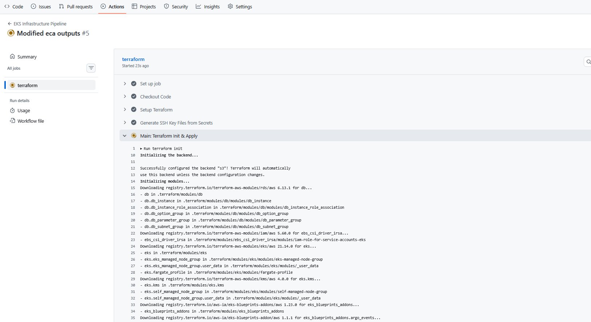
</p>

<p align="center">
  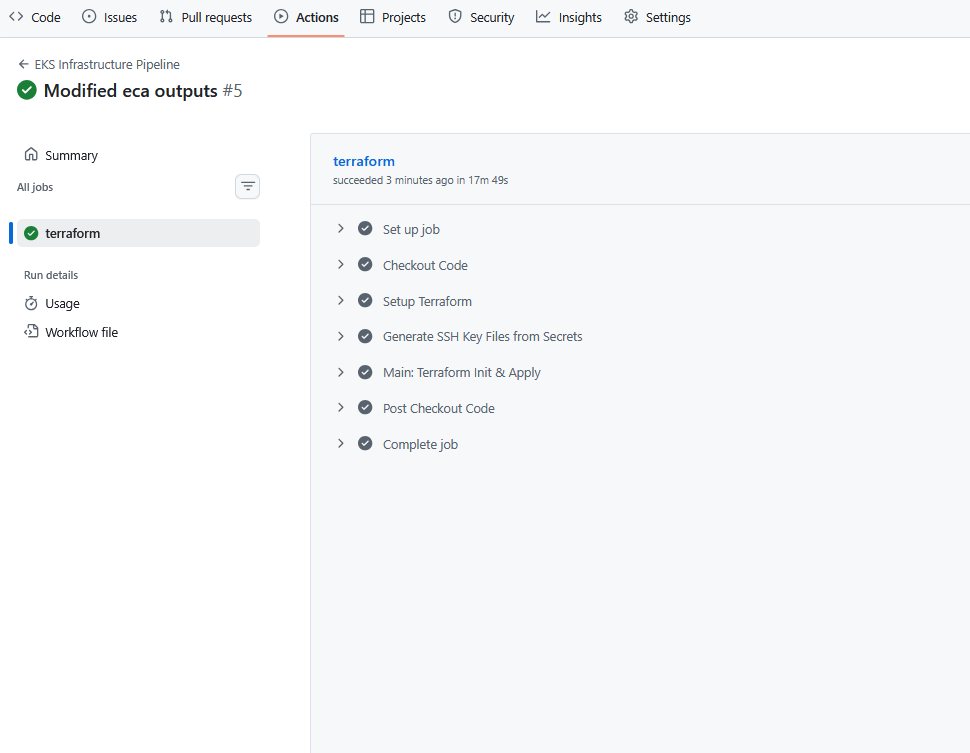
</p>


These outputs shows that core infrastructure components such as the EKS cluster, Bastion host, database, and cache layers were provisioned correctly and are accessible for operations and troubleshooting.

<p align="center">
  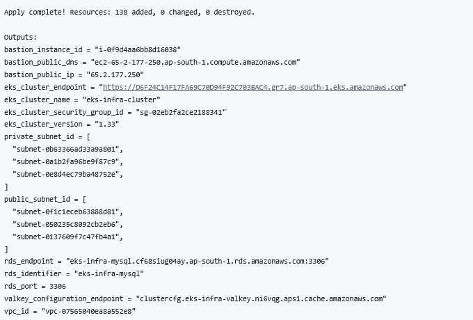
</p>

**What is validated:**
* EKS cluster name and API endpoint
* Bastion host public IP and DNS
* RDS MySQL endpoint and port
* ElastiCache (Valkey) configuration endpoint

Terraform outputs act as the final infrastructure-level verification before application and GitOps validation.

</details>


<details>
<summary><b>ExternalDNS & Route 53 Records Validation</b></summary>

The images below demonstrate the successful operation of **ExternalDNS**, confirming that DNS records were automatically created and managed in Amazon Route 53 based on Kubernetes Ingress resources.

This validates the end-to-end integration between EKS, the AWS Load Balancer Controller, and Route 53 without any manual DNS configuration.

<table align="center">
  <tr>
    <th align="center">Application</th>
    <th align="center">A Record</th>
    <th align="center">TXT Record</th>
    <th align="center">TXT Record</th>
  </tr>

  <tr>
    <td align="center"><b>Application</b><br>app.sreevasmk.in</td>
    <td align="center">
      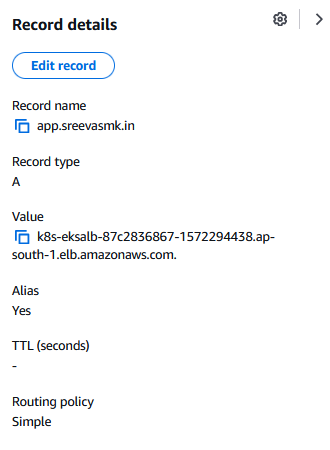
    </td>
    <td align="center">
      
    </td>
    <td align="center">
      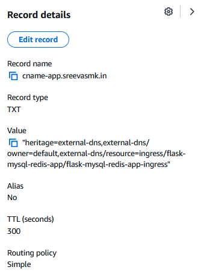
    </td>
  </tr>

  <tr>
    <td align="center"><b>ArgoCD</b><br>argocd.sreevasmk.in</td>
    <td align="center">
      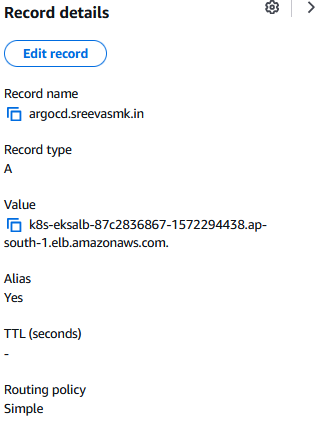
    </td>
    <td align="center">
      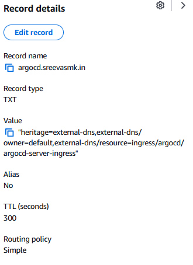
    </td>
    <td align="center">
      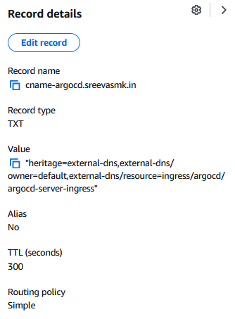
    </td>
  </tr>

  <tr>
    <td align="center"><b>Grafana</b><br>grafana.sreevasmk.in</td>
    <td align="center">
      
    </td>
    <td align="center">
      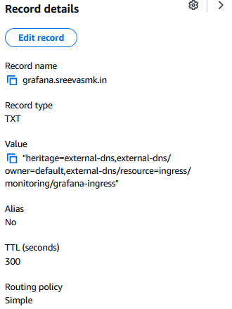
    </td>
    <td align="center">
      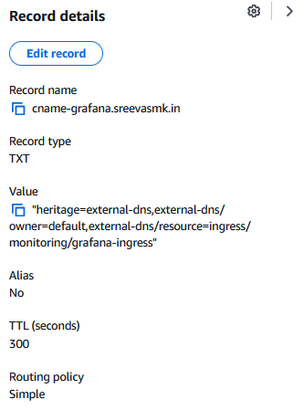
    </td>
  </tr>
</table>

**What is validated:**
* Automatic DNS record creation for application, ArgoCD, and Grafana services
* Correct mapping of ALB endpoints to public domain names
* Presence of ownership **TXT records** used by ExternalDNS
* No manual Route 53 configuration required

These records confirm that Kubernetes Ingress resources are correctly synchronized with Route 53, enabling public access to services through stable and human-readable domain names.

</details>


<details>
<summary><b>Initial Node & Cluster Checks (Bastion Host)</b></summary>

**Purpose:**
Validate EKS cluster access, node readiness, namespaces, workloads, and ingress resources from the bastion host.

**Actions Performed:**

* Configure kubeconfig for the EKS cluster
* Verify node availability and pod capacity
* Inspect namespaces and running workloads
* Validate ingress resources across namespaces

**Commands Used:**

```bash
aws eks update-kubeconfig --region ap-south-1 --name eks-infra-cluster

kubectl get nodes
kubectl describe node <node-name> | grep pod

kubectl get ns
kubectl get all -n flask-mysql-redis-app
kubectl get all -n argocd
kubectl get all -n monitoring

kubectl get ingress -A
```

**Video Link:**
 [https://youtu.be/k190lIqya7I](https://youtu.be/k190lIqya7I)

</details>

<details>
<summary><b>Ingress & Load Balancer Verification</b></summary>

**Purpose:**
Validate ingress routing, DNS, and AWS Application Load Balancer configuration.

**Actions Performed:**

* Inspect ALB configuration in AWS Console
* Verify HTTPS routing for all exposed services ( ArgoCD, Grafana, and Application)
* Confirm ingress rules are functioning correctly

<p align="center">
  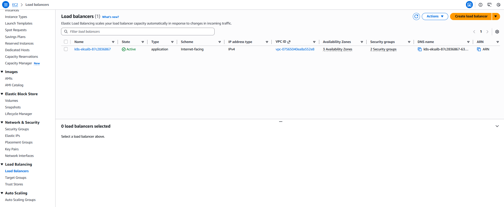
</p>

<p align="center">
  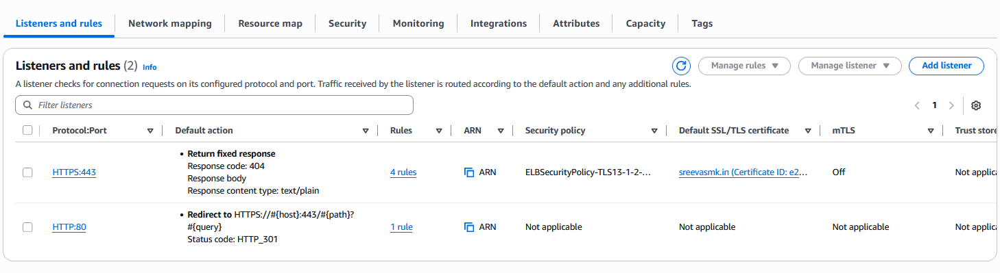
</p>

<p align="center">
  
</p>

<p align="center">
  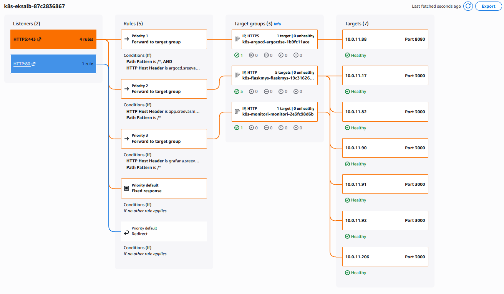
</p>


We can use the following command to find ArgoCD admin password (Inside Bastion host)
```bash
kubectl -n argocd get secret argocd-initial-admin-secret -o jsonpath="{.data.password}" | base64 -d
```

<p align="center">
  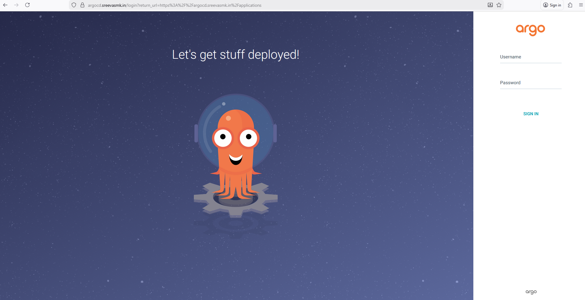
</p>

<p align="center">
  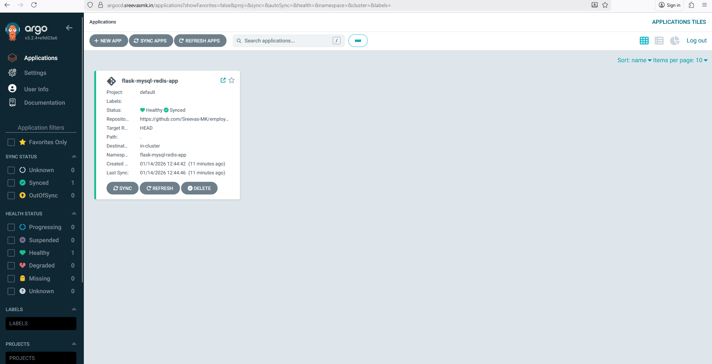
</p>

<p align="center">
  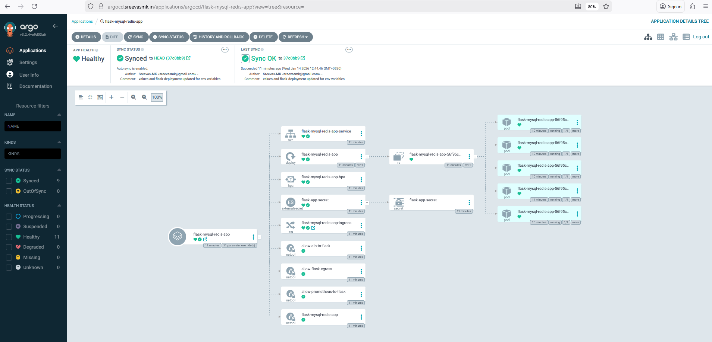
</p>

We can use the following command to find Grafana admin password
```bash
kubectl get secrets monitoring-stack-grafana -o jsonpath="{.data.admin-password}" -n monitoring | base64 -d ; echo
```
<p align="center">
  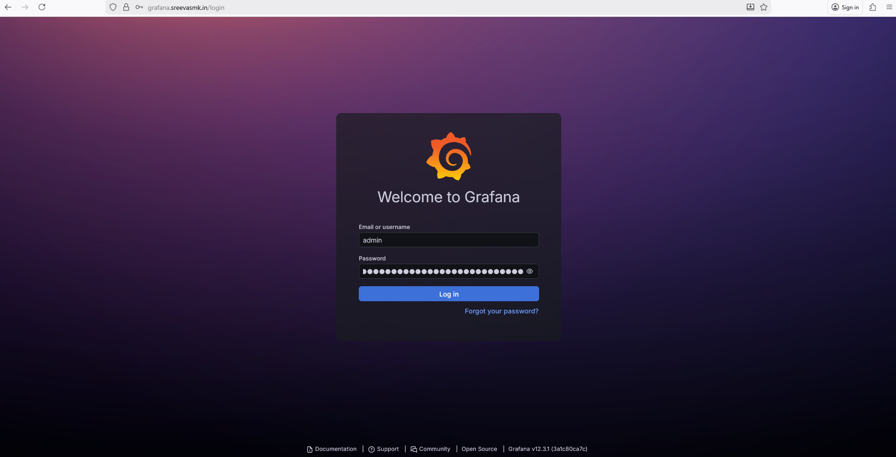
</p>

<p align="center">
  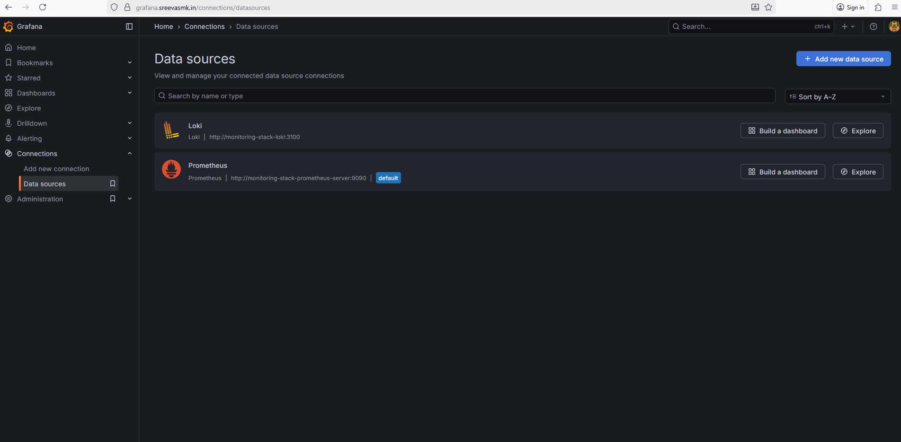
</p>

<p align="center">
  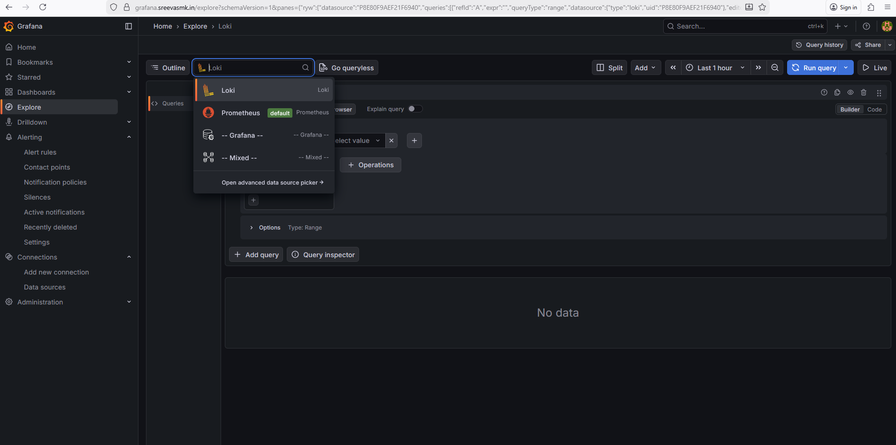
</p>

<p align="center">
  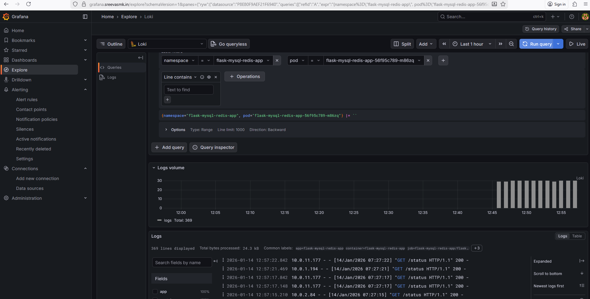
</p>

<p align="center">
  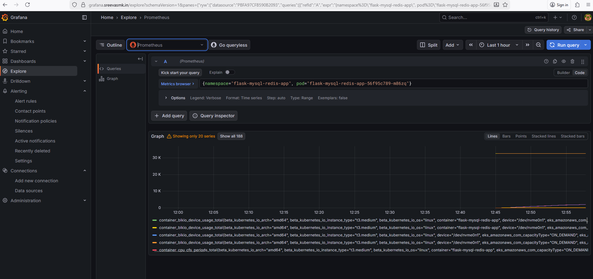
</p>


**Video Link:**
[https://youtu.be/fLqPJPAIo0E](https://youtu.be/fLqPJPAIo0E)

</details>

<details>
<summary><b>Application Functionality & MySQL Validation</b></summary>

**Purpose:**
Validate application connectivity to Amazon RDS MySQL and confirm database write operations.

<p align="center">
  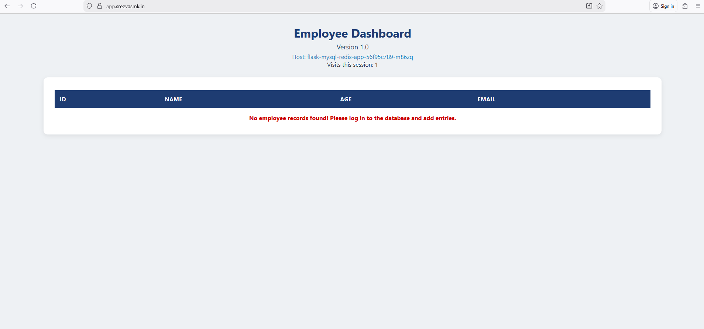
</p>

**Actions Performed:**

* Launch a temporary MySQL client pod
* Connect to Amazon RDS MySQL instance
* Insert records into the application database
* Check application URL to verify the changes

**Commands Used:**

```bash
kubectl run mysql-client --rm -it --image=mysql:8.0 -- /bin/bash

mysql -h <db_instance_address> \
  -P 3306 -u appadmin -p
```
Where <db_instance_address> is RDS instance address. (Example: eks-infra-mysql.cf68siug04ay.ap-south-1.rds.amazonaws.com )

<p align="center">
  
</p>

**SQL Operations:**

Select the database
```sql
use company;
```

Insert values into 'employees' table
```sql
INSERT INTO employees (id,name,age,email) VALUES
(100,"Alex",25,"alex@gmail.com"),
(101,"Ben",28,"ben@gmail.com"),
(102,"Christy",26,"christy@gmail.com"),
(103,"Emily",30,"emily@gmail.com");
```
<p align="center">
  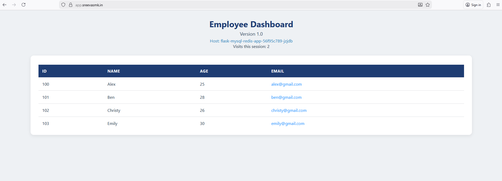
</p>

**Video Link:**
[https://youtu.be/S_M4QLjZgWE](https://youtu.be/S_M4QLjZgWE)

</details>

<details>
<summary><b>Data Persistence Validation</b></summary>

**Purpose:**
Verify data persistence by deleting the application deployment and confirming data remains intact.

**Actions Performed:**

* Delete the Flask application deployment
* Redeploy / re-access the application
* Validate previously inserted MySQL data still exists

**Command Used:**

```bash
kubectl delete deployment <flask-app-deployment-name> -n flask-mysql-redis-app
```

**Result:**

* Application pod recreation confirmed
* Database records persisted successfully

**Video Link:**
[https://youtu.be/yz8HMKDz0w8](https://youtu.be/yz8HMKDz0w8)

</details>

<details>
<summary><b>Infrastructure Teardown Validation (Terraform Destroy)</b></summary>

**Purpose:**
Validate the controlled teardown of the entire infrastructure using a manually triggered Terraform destroy workflow via GitHub Actions.

This ensures that all provisioned resources are properly cleaned up and no orphaned infrastructure remains.

**Actions Performed:**

* Manually triggered the Terraform destroy workflow from GitHub Actions
* Reviewed the destroy plan generated by Terraform
* Executed the destroy operation through the CI/CD pipeline
* Monitored resource deletion order and completion status

**Workflow Execution:**

<p align="center">
  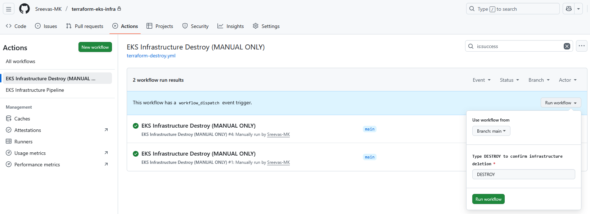
</p>

**Destroy Result:**

<p align="center">
  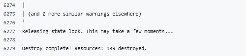
</p>

**Result:**

* Terraform destroy completed successfully without errors
* All AWS infrastructure components were deleted in the correct dependency order
* No orphaned resources remained after teardown
* Confirms safe lifecycle management for both provisioning and deprovisioning phases

**Resource Count Note (Apply vs Destroy):**
During the apply phase, Terraform planned **138 resources**, while the destroy phase planned **139 resources**.
This minor difference is expected in environments using Kubernetes, Helm, and AWS-managed services, where certain resources are **dynamically created or provider-managed at runtime** and are only fully detected during destroy. Terraform correctly identified and cleaned up these resources, ensuring a complete teardown.

This step validates that the infrastructure is fully reversible and adheres to clean-up best practices.

</details>


---

## Challenges & Learnings

Multiple failures occurred during provisioning, syncing, runtime, and destruction.

<details>
<summary><b>Bastion Host & Resource Sizing</b></summary>

**Issue:**  
The initial Bastion Host was launched with a small instance type (`t2.micro`) and a 2GB root disk.

**Impact:**  
Tool installations (Terraform, AWS CLI, kubectl, Helm) failed intermittently due to disk exhaustion.

**Solution:**  
Increased the root volume to **5GB** and used a stable Amazon Linux AMI.

**Lesson Learned:**  
Bastion hosts must be sized realistically. Under-provisioned tooling nodes slow debugging and hide real issues.

</details>

<details>
<summary><b>Terraform Module Dependency & `depends_on` Issues</b></summary>

**Issue:**  
Terraform failed during EKS node group and IRSA creation due to unresolved implicit dependencies.

**Observed Errors:**  
- `Invalid count argument` in EKS managed node groups  
- IAM roles not attached before node group creation  

**Solution:**  
Explicit `depends_on` relationships were added between:
- EKS cluster - node groups  
- IAM roles - IRSA modules  

Terraform does not always infer execution order correctly in complex infrastructures. Explicit dependency control is critical.
</details>

<details>
<summary><b>External Secrets Operator (ESO) Sync Timing Failure</b></summary>

**The Issue:** When the cluster first starts, the Application pods try to start immediately. However, they need a database password to boot. Because the password comes from AWS Secrets Manager via the "External Secrets Operator" (ESO), there is a 30-60 second delay before the password actually appears in Kubernetes.

**The Impact:** The pods looked for a secret that didn't exist yet, got confused, and crashed (`CreateContainerConfigError`).


**Fix:**
1. **Refresh Interval:** Set the secret to check for updates every 10 seconds (`refreshInterval: 10s`) in application repository. This ensures that as soon as AWS is ready, the secret is created.
2. **Self-Healing:** Configured ArgoCD with "Self-Heal." Once the secret finally arrives, ArgoCD detects the pod failure and restarts the app automatically.

</details>

<details>
<summary><b>EKS NodeSelector & Label Misconfiguration</b></summary>

**Issue:**
I configured the EKS Managed Node Groups with specific custom labels (e.g., `workload=app`) and simultaneously set the Cluster Add-ons (like VPC-CNI and CoreDNS) to only run on nodes with those specific labels using a `nodeSelector`.

**Impact:**
EKS node groups became stuck in provisioning and system pods remained in `Pending` state.

**Solution:**
Removed node selectors during bootstrap and applied labels only after node stabilization.

Over-constraining scheduling during cluster bootstrap can break EKS provisioning.

</details>

<details>
<summary><b>Redis (Valkey) SSL & Endpoint String Manipulation</b></summary>

**The Issue:**
The Flask application failed to connect to the Valkey (Redis) cluster, resulting in  connection closures or handshake errors.

**The Root Cause:**

* **SSL Requirement:** The ElastiCache cluster was provisioned with **Transit Encryption (TLS)**. The application driver required an explicit `REDIS_SSL=true` flag to initiate the secure `rediss://` handshake.
* **Port Formatting Conflict:** The AWS Terraform output for the `replication_group_configuration_endpoint_address` includes the port (e.g., `...6379`). The application's Helm chart logic was adding the port a second time, creating an invalid address like `hostname:6379:6379`.

**The Fix (Terraform Implementation):**
I implemented the following logic in the application deployment module to normalize the connection string:

```hcl
# Extracting only the hostname to prevent port duplication
- name: "flask.env.REDIS_HOST"
  value: "${split(":", module.valkey_cache.replication_group_configuration_endpoint_address)[0]}"

# Forcing SSL handshake for encrypted Transit
- name: "flask.env.REDIS_SSL"
  value: "true"

```
AWS-managed service outputs often contain extra metadata (like ports). When passing these to Kubernetes or Helm, you must perform **string manipulation** to match the application's expected format. Additionally, security features like "Transit Encryption" are not transparent; they require explicit application-side configuration to work.

</details>

<details>
<summary><b>ALB Cost & Multi-App Ingress Optimization</b></summary>

**Issue:**
Separate ingress resources would have created three ALBs (ArgoCD, Grafana, App).

**Impact:**
Unnecessary AWS cost.

**Solution:**
Used a shared `group.name` annotation to run all services behind a single ALB.

Design must consider cost efficiency, not just functionality.

</details>


<details>
<summary><b>Terraform Destroy Failures (Ingress & ALB Dependencies)</b></summary>

**Issue:**
During `terraform destroy`, the deletion of the EKS cluster, Node Groups, and VPC sometimes failed or hung. The root cause was related to Kubernetes-managed resources like Ingresses (Grafana, ArgoCD) that create AWS ALBs via the AWS Load Balancer Controller.

**Root Cause:**

1. **Hidden Dependencies:**
   Kubernetes controllers (e.g., aws-load-balancer-controller) create cloud resources (ALBs) automatically. Terraform does **not track these ALBs**, so it doesn’t know to wait for them before deleting the cluster or node groups.

2. **Controller Termination Issue:**
   If Terraform deletes Node Groups or the EKS cluster **before the Ingress resources**, the aws-load-balancer-controller pods stop running. Without the controller, the Ingress deletion cannot trigger the AWS ALB deletion, leaving resources orphaned and causing Terraform destroy to fail.

3. **Timing Dependencies:**
   Some resources (like ArgoCD apps and Helm releases) may take time to fully terminate. Immediate destruction of the underlying namespaces or cluster can interrupt cleanup.

**Solution Implemented:**

1. **Namespace & Ingress Deletion Order:**

   * Added `depends_on` in Kubernetes namespaces and Ingress resources to ensure they are destroyed **before** Node Groups or cluster.
   * Ensures the controller is still running when Ingress deletion is processed.

2. **Destruction Buffer:**

   * Introduced a `null_resource` with a `local-exec` `sleep 60` during destroy.
   * This gives controllers and Kubernetes enough time to remove all ALBs, Services, and other cloud resources before Terraform proceeds with destroying core infrastructure.

3. **Data Source Anchors:**

   * Added `aws_vpc` and `aws_eks_cluster` **data sources** with `depends_on = [null_resource.destruction_dependencies]`.
   * Ensures Terraform waits for the destruction buffer before deleting the VPC or EKS cluster.

**Resulting Flow:**

| Phase   | Order                                                                                     |
| ------- | ----------------------------------------------------------------------------------------- |
| Create  | EKS → Node Groups → Namespaces → Helm → Apps → Ingress → ALB                              |
| Destroy | Apps → Helm → Namespaces → `null_resource` sleep → Data anchors → Node Groups → EKS → VPC |

**Impact:**
This ensures deterministic, failure-free Terraform destroys, even when cloud-managed resources are asynchronously cleaned up by Kubernetes controllers.

</details>

---

